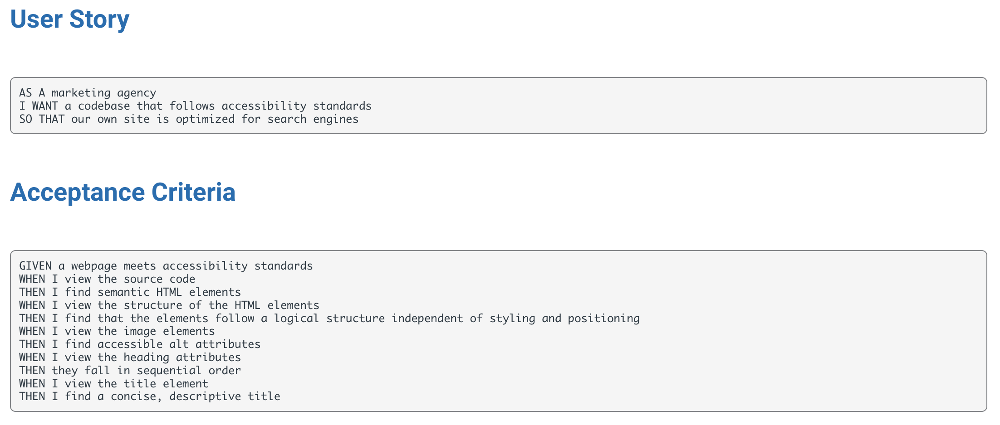

# Horiseon Code Refactor

## Deployed Site

https://elawilliam.github.io/code-refactor/

## Description

This code was refactored and organized in order to create better accessibility for both Horiseon and the end user - potential clientele. It is structured in a way that is more sustainable for long-term use and is better configured for search engine optimization.

## Usage

The refactored code has notes in the HTML as well as CSS files to explain the changes that were made and the intention of usability moving forward.

## License

Please refer to the LICENSE in the repo.